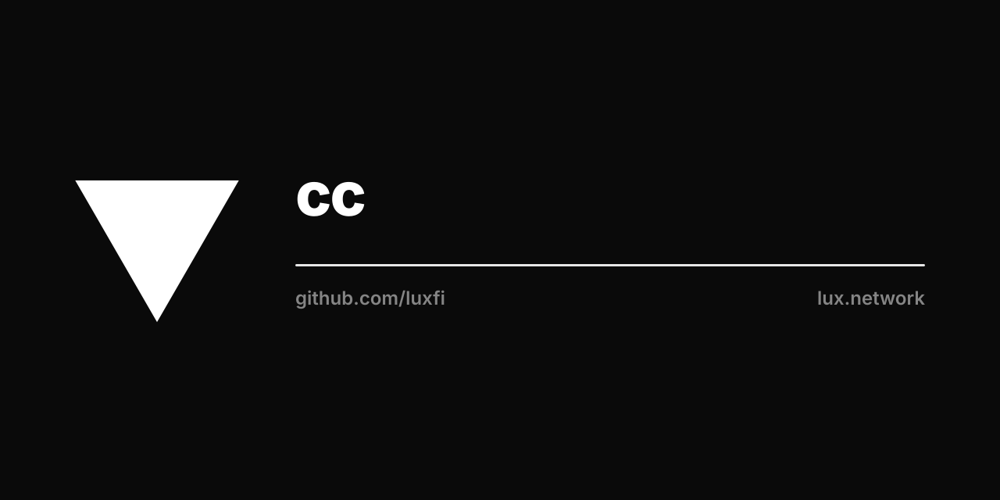

<p align="center"></p>

# luxfi/cc — Confidential Compute attestation

`github.com/luxfi/cc` is the **single, vendor-neutral attestation verifier**
for the Lux confidential-compute control plane. It is an orthogonal leaf:
the MPC custody system (`luxfi/mpc`), the TEE custody extension (`luxfi/tee`),
and the confidential-AI / proof-of-AI system (`luxfi/ai`) all depend on it,
and it depends on **none of them**. There is exactly one attestation verifier;
hardware platforms are orthogonal `Kind`s behind one `Verify` interface.

## Packages

| Import | Purpose |
|--------|---------|
| `github.com/luxfi/cc/attest` | The `Verifier` interface, `VerifiedReport`, `Option`, and `Dispatch(kind, evidence, opts...)`. One entry point per hardware `Kind`. |
| `github.com/luxfi/cc/attest/nvidia` | NVIDIA GPU primitives: GPU evidence parser, signed-RIM verifier + measurement matcher, and the NRAS remote-attestation JWS client. Backend for `KindNVTrust`. |

## Kinds (orthogonal hardware platforms)

- **`KindSEVSNP`** — AMD SEV-SNP CPU. PRODUCTION. Live VCEK fetch from the AMD
  KDS, full ARK→ASK→VCEK chain + report-signature verification
  (`google/go-sev-guest`).
- **`KindTDX`** — Intel TDX CPU. Stub (`ErrNotImplemented`, fail-loud). Tracked
  for `go-tdx-guest` + Intel PCS.
- **`KindNVTrust`** — NVIDIA GPU confidential compute. PRODUCTION **local-RIM
  mode** (cloud-free): verifies the NVIDIA-signed Reference Integrity Manifest
  against an operator-pinned key, then matches every reported GPU measurement
  to the signed golden value. No NVIDIA cloud dependency. The remote NVIDIA
  Remote Attestation Service (NRAS) JWS path is the lower-level
  `nvidia.NRASClient` primitive for deployments that accept a cloud anchor.

## Invariants

- **No insecure mode.** A verify with no trust anchor is refused, never
  best-effort. `KindNVTrust` refuses an empty RIM or empty trust-root set.
- **One `VerifiedReport` type** shared across all consumers — required so the
  `kms.CompositeAttestation` release-gate interface has a single, unambiguous
  signature across `luxfi/mpc`, `luxfi/tee`, and `luxfi/ai`.
- **`(nil, err)` means refuse.** No partial reports on error.
- **Tests never hit the network.** AMD KDS responses are replayed from
  `attest/testdata`; NVIDIA RIM fixtures are signed in-test.

## Build

```sh
export SDKROOT="$(xcrun --show-sdk-path)"   # macOS
GOWORK=off go build ./...
GOWORK=off go test ./...
```
